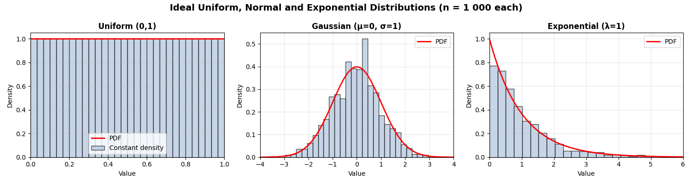

# Zipper: A Test Data Generation Tool

Zipper is a .NET command-line tool for generating large zip files containing placeholder documents (`.pdf`, `.jpg`, `.tiff`, `.eml`, `.docx`, `.xlsx`) and a corresponding load file. It's designed for performance testing and can generate archives with up to 100 million files.

## Features

- Generates a single `.zip` archive with a specified number of files
- Supports multiple file types: PDF, JPG, TIFF, EML, DOCX, XLSX
- Supports multiple load file formats: DAT, OPT, CSV, EDRM-XML
- Supports multiple file distribution patterns: proportional, gaussian, and exponential
- Supports Bates numbering for legal document identification
- Supports multipage TIFF files with configurable page count ranges
- Creates a corresponding load file compatible with standard import tools
- Uses minimal, valid placeholder files for maximum compression
- Streams data directly to the archive to handle very large datasets efficiently
- Provides progress indication during generation with real-time performance metrics
- Can target a specific zip file size by padding files with non-compressible data
- Optimized for high-performance parallel processing with memory pooling and buffered I/O
- Real-time performance monitoring with progress tracking, throughput metrics, and ETA calculations
- **Loadfile-Only mode**: Generate standalone load files (DAT/OPT) without ZIP archives or native files
- **Chaos Engine**: Inject deliberate structural anomalies into load files for ingestion resilience testing

## Requirements

- .NET 8.0 SDK (or newer)
- The following NuGet packages are also required and are included in the project file:
  - `SixLabors.ImageSharp` - For TIFF image generation
  - `ClosedXML` - For XLSX spreadsheet generation
  - `DocumentFormat.OpenXml` - For DOCX document generation
  - `System.Drawing.Common` - For image processing
  - `System.Text.Encoding.CodePages` - For ANSI encoding support

## Building

To build a release version of the executable, run the following command from the root of the project:

```bash
dotnet publish -c Release
```

This will place the executable (`zipper.exe` on Windows, `zipper` on Linux/macOS) in the `src/bin/Release/net8.0/<platform-specific-folder>/publish/` directory.

## Usage

After building the project, you can run the executable directly. The examples below assume the executable is in your system's PATH. Alternatively, you can still use `dotnet run` from the project directory.

### Syntax

```bash
zipper --type <filetype> --count <number> --output-path <directory> [--folders <number>] [--encoding <UTF-8|UTF-16|ANSI>] [--distribution <proportional|gaussian|exponential>] [--with-metadata] [--with-text] [--attachment-rate <number>] [--target-zip-size <size>] [--include-load-file] [--load-file-format <format>] [--bates-prefix <prefix>] [--bates-start <number>] [--bates-digits <number>] [--tiff-pages <min-max>] [--loadfile-only] [--eol <CRLF|LF|CR>] [--col-delim <ascii:N|char:C>] [--quote-delim <ascii:N|char:C|none>] [--newline-delim <ascii:N|char:C>] [--multi-delim <ascii:N|char:C>] [--nested-delim <ascii:N|char:C>] [--chaos-mode] [--chaos-amount <N|N%>] [--chaos-types <type1,type2,...>]
```

### Arguments

**Required Arguments:**
- `--type <pdf|jpg|tiff|eml|docx|xlsx>`: **(Required unless `--loadfile-only`)** The type of file to generate. Defaults to `pdf` when `--loadfile-only` is used
- `--count <number>`: **(Required)** The total number of files/records to generate
- `--output-path <directory>`: **(Required)** The directory where the output files will be saved. The directory will be created if it doesn't exist

**Optional Arguments:**
- `--folders <number>`: The number of folders to distribute files into. Defaults to 1. Must be between 1 and 100
- `--encoding <UTF-8|UTF-16|ANSI>`: The text encoding for the load file. Defaults to `UTF-8`. `ANSI` uses the Windows-1252 code page
- `--distribution <proportional|gaussian|exponential>`: The distribution pattern for files across folders. Defaults to `proportional`
  - `proportional`: Even distribution across all folders (round-robin)
  - `gaussian`: Bell curve distribution with most files in middle folders
  - `exponential`: Exponential decay with most files in first folders
- `--with-metadata`: Generates a load file with additional metadata columns (Custodian, Date Sent, Author, File Size). Supported for all file types including `eml`
- `--with-text`: Generates a corresponding extracted text file for each document and adds the path to the load file. Supported for all file types including `eml`
- `--attachment-rate <number>`: When type is `eml`, specifies the percentage of emails (0-100) that will receive a random document as an attachment. Defaults to 0
- `--target-zip-size <size>`: Specifies a target size for the final zip file (e.g., 500MB, 10GB). This feature works by padding each of the `--count` files with uncompressible data to meet the target size. This significantly reduces the overall compression ratio and is intended for specific network or storage performance testing scenarios. Requires `--count`
- `--include-load-file`: Includes the generated load file in the root of the output `.zip` archive instead of as a separate file
- `--load-file-format <dat|opt|csv|edrm-xml>`: The format of the load file. Defaults to `dat`. Available formats:
  - `dat`: Standard Concordance DAT format with ASCII 20/254/174 delimiters
  - `opt`: Opticon format - comma-separated, page-level image references
  - `csv`: Comma-separated values format with RFC 4180 escaping
  - `edrm-xml`: EDRM XML format - Electronic Discovery Reference Model schema v1.2
- `--load-file-formats <format1,format2,...>`: Generate multiple load file formats simultaneously (e.g., `dat,opt,csv`)
- `--dat-delimiters <standard|csv>`: DAT delimiter style. `standard` uses ASCII 20/254/174, `csv` uses comma/quote. Defaults to `standard`
- `--bates-prefix <prefix>`: Prefix for Bates numbering (e.g., "CLIENT001")
- `--bates-start <number>`: Starting number for Bates numbering. Defaults to 1
- `--bates-digits <number>`: Number of digits for Bates numbering. Defaults to 8
- `--tiff-pages <min-max>`: Page count range for TIFF files (e.g., "1-20"). Defaults to "1-1"

**Column Profile Options:**
- `--column-profile <name|path>`: Column profile for configurable metadata generation. Use built-in profiles (`minimal`, `standard`, `litigation`, `full`) or path to custom JSON file
- `--seed <number>`: Random seed for reproducible output. Use the same seed to generate identical data
- `--date-format <format>`: Override the default date format (e.g., "yyyy-MM-dd", "MM/dd/yyyy")
- `--empty-percentage <0-100>`: Override the default empty value percentage for optional fields
- `--custodian-count <1-1000>`: Override the number of custodians in the data pool. Maximum 1000
- `--with-families`: Generate parent-child document relationships (BEGATTACH, ENDATTACH, PARENTDOCID columns)

**Loadfile-Only Options:**
- `--loadfile-only`: Generate standalone load files (DAT or OPT) directly to disk without creating ZIP archives or native files. Produces a companion `_properties.json` audit file. `--type` becomes optional (defaults to `pdf` for schema). Conflicts with `--target-zip-size` and `--include-load-file`
- `--eol <CRLF|LF|CR>`: Line ending format for the generated load file. Defaults to `CRLF`
- `--col-delim <ascii:N|char:C>`: Column delimiter using strict prefix format. Requires `--loadfile-only`. Example: `ascii:20` or `char:|`
- `--quote-delim <ascii:N|char:C|none>`: Quote delimiter using strict prefix format, or `none` to omit quotes. Requires `--loadfile-only`. Example: `ascii:254` or `none`
- `--newline-delim <ascii:N|char:C>`: In-field newline replacement using strict prefix format. Requires `--loadfile-only`. Example: `ascii:174`
- `--multi-delim <ascii:N|char:C>`: Multi-value separator for fields with multiple values. Requires `--loadfile-only`. Example: `char:;`
- `--nested-delim <ascii:N|char:C>`: Nested value separator for hierarchical fields. Requires `--loadfile-only`. Example: `char:\`

**Chaos Engine Options:**
- `--chaos-mode`: Enable the Chaos Engine to inject deliberate structural anomalies into load files. Requires `--loadfile-only`
- `--chaos-amount <N|N%>`: Number or percentage of records to corrupt. Requires `--chaos-mode`. Example: `5` (exact count) or `10%` (percentage)
- `--chaos-types <type1,type2,...>`: Comma-separated filter for specific anomaly types. Requires `--chaos-mode`. DAT types: `mixed-delimiters`, `quotes`, `columns`, `eol`, `encoding`. OPT types: `opt-boundary`, `opt-columns`, `opt-pagecount`

### Arguments Quick Reference

| Argument | Default | Range/Values | Description |
|----------|---------|--------------|-------------|
| `--type` | **required** | pdf, jpg, tiff, eml, docx, xlsx | File type to generate |
| `--count` | **required** | positive integer | Number of files |
| `--output-path` | **required** | directory path | Output directory |
| `--folders` | 1 | 1-100 | Number of folders |
| `--encoding` | UTF-8 | UTF-8, UTF-16, ANSI | Load file encoding |
| `--distribution` | proportional | proportional, gaussian, exponential | File distribution |
| `--with-metadata` | false | flag | Include metadata columns |
| `--with-text` | false | flag | Generate text files |
| `--attachment-rate` | 0 | 0-100 | EML attachment % |
| `--target-zip-size` | none | KB/MB/GB (e.g., 500MB) | Target ZIP size |
| `--include-load-file` | false | flag | Load file in ZIP |
| `--load-file-format` | dat | dat, opt, csv, edrm-xml | Load file format |
| `--load-file-formats` | none | comma-separated | Multiple formats |
| `--dat-delimiters` | standard | standard, csv | DAT delimiter style |
| `--delimiter-column` | ASCII 20 | char or ASCII code | Custom column delimiter |
| `--delimiter-quote` | ASCII 254 | char or ASCII code | Custom quote delimiter |
| `--delimiter-newline` | ASCII 174 | char or ASCII code | Custom newline replacement |
| `--bates-prefix` | none | string | Bates prefix |
| `--bates-start` | 1 | ≥0 | Bates start number |
| `--bates-digits` | 8 | 1-20 | Bates digit count |
| `--tiff-pages` | 1-1 | min-max | TIFF page range |
| `--column-profile` | none | minimal, standard, litigation, full, or path | Column profile |
| `--seed` | none | integer | Random seed |
| `--date-format` | yyyy-MM-dd | format string | Date format override |
| `--empty-percentage` | 15 | 0-100 | Empty value % override |
| `--custodian-count` | none | 1-1000 | Custodian count override |
| `--with-families` | false | flag | Family relationships |
| `--loadfile-only` | false | flag | Standalone load file (no ZIP) |
| `--eol` | CRLF | CRLF, LF, CR | Load file line endings |
| `--col-delim` | ASCII 20 | `ascii:N` or `char:C` | Column delimiter (strict) |
| `--quote-delim` | ASCII 254 | `ascii:N`, `char:C`, or `none` | Quote delimiter (strict) |
| `--newline-delim` | ASCII 174 | `ascii:N` or `char:C` | Newline replacement (strict) |
| `--multi-delim` | none | `ascii:N` or `char:C` | Multi-value separator |
| `--nested-delim` | none | `ascii:N` or `char:C` | Nested value separator |
| `--chaos-mode` | false | flag | Enable Chaos Engine |
| `--chaos-amount` | 1% | N or N% | Anomaly count/percentage |
| `--chaos-types` | all | comma-separated types | Anomaly type filter |

### Argument Interactions

> [!IMPORTANT]
> Some arguments have dependencies or conflicts. Review these rules when combining options.

| Interaction | Behavior |
|-------------|----------|
| `--column-profile` + `--with-metadata` | Column profile takes precedence; `--with-metadata` is ignored with a warning |
| `--target-zip-size` | Requires `--count` to be specified |
| `--attachment-rate` | Only meaningful when `--type eml` |
| `--tiff-pages` | Only meaningful when `--type tiff` |
| `--bates-start`, `--bates-digits` | Only meaningful when `--bates-prefix` is specified |
| `--date-format`, `--empty-percentage`, `--custodian-count` | Only meaningful when `--column-profile` is specified |
| `--load-file-formats` vs `--load-file-format` | Multi-format list takes precedence over single format |
| `--include-load-file` + `--load-file-formats` | All specified formats are included in the ZIP |
| `--delimiter-*` + `--dat-delimiters` | Specific delimiter flags override the preset for that delimiter only |
| `--loadfile-only` + `--target-zip-size` | **Conflict**: cannot use both |
| `--loadfile-only` + `--include-load-file` | **Conflict**: cannot use both |
| `--col-delim`, `--quote-delim`, etc. | Require `--loadfile-only`; use `ascii:N` or `char:C` prefix |
| `--chaos-mode` | Requires `--loadfile-only` |
| `--chaos-amount`, `--chaos-types` | Require `--chaos-mode` |

### Column Profiles

Column profiles allow you to generate rich, configurable metadata with up to 200 columns. Built-in profiles:

| Profile | Columns | Description |
|---------|---------|-------------|
| `minimal` | 5 | Basic fields: DOCID, FILEPATH, CUSTODIAN, DATECREATED, FILESIZE |
| `standard` | 25 | Common e-discovery fields including dates, people, classification |
| `litigation` | 50 | Full litigation support with privilege, responsiveness, hashes |
| `full` | 127 | Maximum coverage with custom tags, issues, and notes |

Column types supported:
- `identifier`: Sequential document IDs (DOC00000001)
- `text`: Short text values from data sources
- `longtext`: Lorem ipsum paragraphs for notes/descriptions
- `date`: Formatted dates within configurable ranges
- `datetime`: Formatted date/time values
- `number`: Numeric values with distribution patterns
- `boolean`: Y/N or True/False values
- `coded`: Values from predefined lists
- `email`: Generated email addresses


### Distribution Patterns

The following chart illustrates how files are distributed across folders using different distribution patterns:



- **Proportional**: Files are distributed evenly across all folders in a round-robin fashion
- **Gaussian**: Files follow a bell curve distribution, with most files concentrated in the middle folders
- **Exponential**: Files follow an exponential decay pattern, with the highest concentration in the first folders

### Examples

To generate a zip file containing 50,000 PDF files distributed across 10 folders using a gaussian distribution pattern:

```bash
zipper --type pdf --count 50000 --output-path ./test_data --folders 10 --distribution gaussian
```

This command will produce two files in the `test_data` directory, with filenames based on the current date and time (e.g., `archive_YYYYMMDD_HHMMSS.zip` and `archive_YYYYMMDD_HHMMSS.dat`):
- A zip file containing 50,000 PDFs distributed across 10 folders
- The load file pointing to the documents within the archive

#### Additional Use Cases

```bash
# Generate 10,000 PDFs with default proportional distribution
zipper --type pdf --count 10000 --output-path ./test --folders 5

# Generate 25,000 JPGs with a Gaussian (bell curve) distribution
zipper --type jpg --count 25000 --output-path ./test --folders 20 --distribution gaussian

# Generate 5,000 TIFFs with an exponential decay distribution
zipper --type tiff --count 5000 --output-path ./test --folders 10 --distribution exponential

# Generate a load file with additional metadata columns
zipper --type pdf --count 1000 --output-path ./test --with-metadata

# Generate a load file with extracted text placeholders
zipper --type tiff --count 25000 --output-path ./test_data --with-text

# Combine all options: 100k TIFFs with metadata and text, distributed across 50 folders
zipper --type tiff --count 100000 --output-path ./test_data --folders 50 --distribution gaussian --with-metadata --with-text

# Generate 5,000 emails with a 20% chance of having an attachment
zipper --type eml --count 5000 --output-path ./email_test --attachment-rate 20

# Generate emails with metadata (Custodian, Author, Date Sent, File Size)
zipper --type eml --count 1000 --output-path ./email_metadata --with-metadata

# Generate emails with extracted text files
zipper --type eml --count 2500 --output-path ./email_text --with-text

# Generate emails with both metadata and extracted text
zipper --type eml --count 3000 --output-path ./email_full --with-metadata --with-text

# Generate emails with attachments, metadata, and text
zipper --type eml --count 2000 --output-path ./email_complete --with-metadata --with-text --attachment-rate 30

# Generates exactly 100,000 PDF files and pads each one with uncompressible
# data so that the final compressed zip archive is approximately 1GB in size
zipper --type pdf --count 100000 --target-zip-size 1GB --output-path ./test_padded_files

# Generate 1,000 PDFs and include the load file inside the zip archive
zipper --type pdf --count 1000 --output-path ./test_inclusive --include-load-file

# Generate DOCX files with Bates numbering
zipper --type docx --count 500 --output-path ./test_docx --bates-prefix "CLIENT001" --bates-start 1 --bates-digits 8

# Generate XLSX files with custom load file format
zipper --type xlsx --count 1000 --output-path ./test_xlsx --load-file-format csv

# Generate TIFF files with variable page counts (1-20 pages per file)
zipper --type tiff --count 5000 --output-path ./test_tiff --tiff-pages "1-20"

# Combine new features: DOCX with Bates numbering, CSV load file, and metadata
zipper --type docx --count 1000 --output-path ./test_combined --bates-prefix "CASE001" --bates-start 5000 --bates-digits 10 --load-file-format csv --with-metadata

# Generate TIFF files with page count tracking and Bates numbering
zipper --type tiff --count 2500 --output-path ./test_tiff_bates --tiff-pages "5-50" --bates-prefix "IMG" --bates-digits 8 --with-metadata

# Generate emails with XML load file format
zipper --type eml --count 5000 --output-path ./test_eml_xml --load-file-format edrm-xml --with-metadata --with-text

# Generate PDFs with the standard column profile (24 metadata columns)
zipper --type pdf --count 1000 --output-path ./test_profiles --column-profile standard

# Generate with litigation profile (48 columns) for complex e-discovery workflows
zipper --type pdf --count 5000 --output-path ./litigation_data --column-profile litigation

# Generate reproducible output using a seed
zipper --type pdf --count 1000 --output-path ./reproducible --column-profile standard --seed 12345

# Generate multiple load file formats simultaneously
zipper --type pdf --count 1000 --output-path ./multi_format --load-file-formats dat,opt,csv

# Generate with custom date format and empty percentage
zipper --type pdf --count 1000 --output-path ./custom --column-profile standard --date-format "MM/dd/yyyy" --empty-percentage 25

# Generate family relationships for email attachments
zipper --type eml --count 2000 --output-path ./families --attachment-rate 30 --with-families

# ── Loadfile-Only Mode ──────────────────────────

# Generate a standalone DAT load file (no ZIP, no native files)
zipper --loadfile-only --count 100000 --output-path ./dat_only

# Generate a standalone OPT load file in Opticon 7-column format
zipper --loadfile-only --loadfile-format opt --count 50000 --output-path ./opt_only

# Custom delimiters with strict prefix format and LF line endings
zipper --loadfile-only --count 10000 --output-path ./custom_delims \
    --col-delim "char:|" --quote-delim "char:\"" --eol LF

# Loadfile-only with no quotes (unquoted pipe-delimited)
zipper --loadfile-only --count 5000 --output-path ./unquoted \
    --col-delim "char:|" --quote-delim none

# ── Chaos Engine ────────────────────────────────

# Inject anomalies into 5% of records for ingestion testing
zipper --loadfile-only --count 100000 --output-path ./chaos_test \
    --chaos-mode --chaos-amount "5%" --seed 42

# Target only quote and column anomalies
zipper --loadfile-only --count 50000 --output-path ./chaos_targeted \
    --chaos-mode --chaos-amount 100 --chaos-types "quotes,columns"

# OPT chaos: corrupt document boundaries and page counts
zipper --loadfile-only --loadfile-format opt --count 10000 --output-path ./opt_chaos \
    --chaos-mode --chaos-types "opt-boundary,opt-pagecount"
```

## Performance

Zipper is optimized for high-performance file generation with advanced parallel processing capabilities.

### Performance Architecture

- **Parallel Processing**: Multi-threaded file generation with configurable worker pools that automatically optimize based on CPU core count
- **Memory Pooling**: Advanced object pooling reduces garbage collection pressure and memory allocations by up to 50%
- **Buffered I/O**: Intelligent buffering minimizes disk I/O overhead and improves throughput
- **Performance Monitoring**: Real-time progress tracking with detailed performance metrics and ETA calculations

### Performance Benchmarks

Typical performance on modern hardware with parallel processing enabled:

| File Count | Estimated Time | Files/Second | Memory Usage | Improvement |
|------------|---------------|--------------|--------------|-------------|
| 1,000      | 1-2 seconds   | 500-1,500    | Low          | ~2x faster  |
| 10,000     | 5-10 seconds  | 1,000-3,000  | Moderate     | ~2x faster  |
| 100,000    | 30-60 seconds | 1,500-4,000  | Optimized    | ~2x faster  |

*Performance varies based on hardware, file type, and options selected. Parallel processing provides up to 3x improvement over single-threaded generation.*

### Real-time Performance Monitoring

During file generation, you'll see detailed progress updates:

```
Starting parallel file generation...
  File Type: pdf
  Count: 50,000
  Worker Threads: 8 (auto-detected)
  Batch Size: 1000

Progress: 25,000 / 50,000 files (50.0%) - 1,250.5 files/sec - ETA: 00:00:20
Memory Usage: 45.2 MB | GC Collections: Gen0=142, Gen1=8, Gen2=1

Generation complete in 40.2 seconds.
  Performance: 1,243.8 files/second
  Memory Efficiency: 98.5% (low GC pressure)
```

### Automatic Performance Optimization

The system automatically:
- Detects and optimizes for available CPU cores
- Manages memory efficiently to handle large file counts without excessive allocations
- Provides detailed throughput metrics and time estimates
- Balances parallelization with memory usage for optimal performance

## Versioning

Versioning is managed automatically via Git Tags:
- **Versioning Strategy**: Uses Semantic Versioning (`vMAJOR.MINOR.PATCH`).
- **Release Automation**: When a PR is merged to `main`, the system automatically increments the patch version (e.g., `v1.0.0` -> `v1.0.1`) and creates a new release.
- **Manual Control**: You can manually push a tag (e.g., `git tag v1.1.0 && git push`) to trigger a specific version release.
- **Binary Version**: The executable tracks the release version exactly (e.g., `1.0.1`) without commit hashes.

## Testing

The project includes a comprehensive test suite that covers all command-line options and performance characteristics. The test suite is designed to be run on Windows, macOS, and Linux.

### Running the Tests

To run the tests, execute the appropriate script for your operating system:

- **Windows**: `tests\run-tests.bat`
- **macOS and Linux**: `./tests/run-tests.sh`

### Performance Testing

The project includes comprehensive performance regression testing to ensure optimal performance.

#### Performance Regression Tests
```bash
# Linux/macOS
./tests/test-performance-regression.sh

# Windows
tests/test-performance-regression.bat
```

#### Performance Features
- **Micro-benchmarks**: BenchmarkDotNet-based performance analysis of all components
- **Regression Testing**: Automated detection of performance degradation
- **Memory Monitoring**: GC pressure and allocation tracking
- **Throughput Analysis**: Files per second and data processing metrics
- **Cross-Platform**: Performance testing on Windows, Linux, and macOS

#### Performance Targets
- **Small Dataset** (100 files): < 2 seconds
- **Medium Dataset** (1,000 files): < 10 seconds
- **Large Dataset** (10,000 files): < 60 seconds
- **Memory Efficiency**: < 500MB peak usage for large datasets
- **Throughput**: 50+ files per second minimum

### Stress Testing

For extreme performance testing and edge case validation, see the [stress test suite](tests/stress/README.md). These tests are designed for manual execution only and test system limits under extreme conditions:

- **10GB File Count Challenge**: Tests maximum file handling (5M files)
- **30GB Attachment-Heavy EML**: Tests attachment processing and large archives
- **Large Load File Performance**: Tests metadata and text extraction performance

**Warning**: Stress tests consume significant system resources and require manual confirmation before execution.

### Pre-Commit Hook

The project includes scripts to set up a pre-commit hook that will run the test suite automatically before each commit. To set up the hook, run the appropriate script for your operating system:

- **Windows**: `setup-hook.bat`
- **macOS and Linux**: `./setup-hook.sh`
