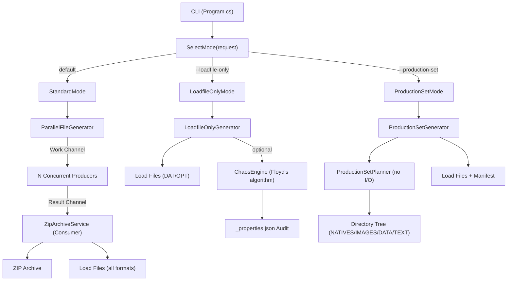
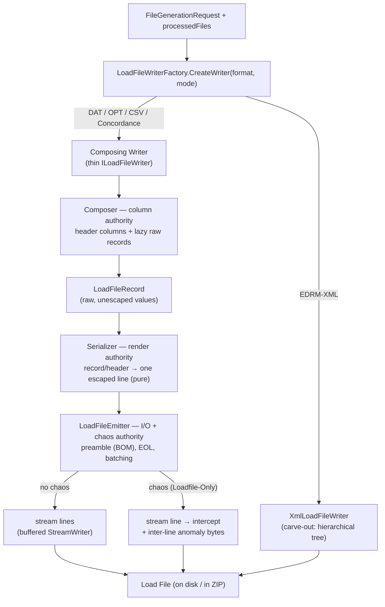

# Zipper Architecture

> **For AI agents:** this file is auto-discovered via [AGENTS.md](../AGENTS.md). The diagrams below are the **source of truth** for Zipper's structure — see [Architecture Invariants](#architecture-invariants-human-approval-required) before making structural changes.

## Architecture Invariants (human approval required)

The diagrams in this file are a **contract**, not just documentation:

- **The load-file pipeline is `composer → serializer → emitter`.** Column decisions live in a **Composer**, line rendering in a **Serializer** (pure — no I/O), and all I/O + chaos in the **Emitter**. Do not reintroduce a "fat writer" that owns more than one of these responsibilities.
- **EDRM-XML is the only carve-out.** It keeps its own `ILoadFileWriter` because it is a hierarchical document tree, not a flat record. Do not force other formats out of the seam, and do not fold XML into it.
- **`ILoadFileWriter` is the format-selection seam** the factory returns; the **Chaos Engine** runs in exactly one place (the emitter), scoped to Loadfile-Only mode (REQ-094).

**Any deviation from these invariants — or any change that makes a diagram inaccurate — requires explicit human approval, plus a same-PR update to the affected diagram.** AI agents: stop and ask the maintainer (e.g. via the AskUserQuestion tool) before merging such a change. See the **Architecture** checklist in the PR template. Decision rationale is recorded in [ADR-0006](adr/ADR-0006-three-mode-pipeline.md) and [ADR-0007](adr/ADR-0007-loadfile-composition-seam.md). See also [ADR-0004](adr/ADR-0004-unified-column-generation.md) (unified column value generation via `IColumnValueGenerator`) and [ADR-0005](adr/ADR-0005-email-aggregate.md) (Email value object + `EmailFactory` as sole constructor).

## Three Generation Modes

`Program.cs` uses `SelectMode(request)` → `IGenerationMode` → `GenerationRunner.RunAsync()` to dispatch to one of three strategies:

| Mode | Trigger | Adapter | Generator |
|------|---------|---------|-----------|
| **Standard** | default | `StandardMode` | `ParallelFileGenerator.GenerateFilesAsync()` → Archive (.zip) + Load File |
| **Loadfile-Only** | `--loadfile-only` | `LoadfileOnlyMode` | `LoadfileOnlyGenerator.GenerateAsync()` → Load File + `_properties.json` audit |
| **Production Set** | `--production-set` | `ProductionSetMode` | `ProductionSetGenerator.GenerateAsync()` → Directory tree (NATIVES/IMAGES/DATA/TEXT) + Load Files |

## Standard Pipeline

`ParallelFileGenerator` uses `System.Threading.Channels` for a producer-consumer pipeline:

1. **Work channel**: Produces `FileWorkItem` objects using the configured distribution algorithm. Bounded channel provides backpressure.
2. **Generation**: N concurrent producers generate file data and write to result channel. All file types run in parallel.
3. **Archive writing**: Single consumer (`ZipArchiveService`) writes ZIP entries, then writes Load Files through the composer → serializer → emitter seam (selected via `ILoadFileWriter`; see [Load File Composition Seam](#load-file-composition-seam)).
4. **Deadlock protection**: `Task.WhenAny` races consumer with producers; if consumer faults, result channel is completed with its exception to unblock producers.

## Chaos Engine (Loadfile-Only Mode only)

`ChaosEngine` uses Floyd's algorithm for O(k) exact random sampling of lines to corrupt. DAT and OPT anomaly types are cataloged in `ChaosAnomalyTypes.cs` — see source for current list. Tracked in `_properties.json` via `LoadfileAuditWriter`.

## Three-Mode Pipeline



## Component Map

```mermaid
graph LR
    subgraph CLI Layer
        CliParser["CliParser"]
        CliValidator["CliValidator"]
        RequestBuilder["RequestBuilder"]
    end

    subgraph Config
        FGR["FileGenerationRequest"]
        FGR --> Output["Output"]
        FGR --> Metadata["Metadata"]
        FGR --> LoadFile["LoadFile"]
        FGR --> Delimiters["Delimiters"]
        FGR --> Bates["Bates"]
        FGR --> Tiff["Tiff"]
        FGR --> Chaos["Chaos"]
        FGR --> Production["Production"]
    end

    subgraph File Generators
        EML["EmlFileGenerator"]
        TIFF["TiffFileGenerator"]
        Office["OfficeFileGenerator"]
        Placeholder["PlaceholderFileGenerator"]
    end

    subgraph Load File Seam
        Factory["LoadFileWriterFactory"]
        Composer["Composer<br/>(Dat/Opt/Csv/Concordance)"]
        Serializer["Serializer<br/>(Dat/Opt/Csv/Concordance)"]
        Emitter["LoadFileEmitter<br/>(preamble/EOL/chaos)"]
        XMLW["XmlLoadFileWriter<br/>(carve-out)"]
        Factory --> Composer --> Serializer --> Emitter
        Factory --> XMLW
    end

    subgraph Profiles
        Loader["ColumnProfileLoader"]
        DataGen["DataGenerator"]
        BuiltIns["BuiltInProfiles"]
    end

    CliParser --> CliValidator --> RequestBuilder --> FGR
    FGR --> File Generators
    FGR --> Load File Seam
    Profiles --> DataGen
```

## Load File Composition Seam

The four delimited formats (DAT, OPT, CSV, Concordance) are produced by three deep modules; EDRM-XML is the carve-out. See the [Architecture Invariants](#architecture-invariants-human-approval-required) — this shape must not be collapsed back into fat writers without human approval.

- **Composer** (`ILoadFileComposer`) — column authority: header columns + lazy `LoadFileRecord`s with raw values (handles modes + column profiles internally).
- **Serializer** (`ILoadFileSerializer`) — render authority: record/header → one escaped line. Pure (no stream, EOL, or chaos).
- **Emitter** (`LoadFileEmitter`) — I/O + chaos authority: encoding preamble (BOM), end-of-line, batching, and the single Chaos Engine pipeline. Both paths stream lazily (O(1) auxiliary memory); the chaos path additionally intercepts each line and writes inter-line encoding-anomaly bytes straight after it.


