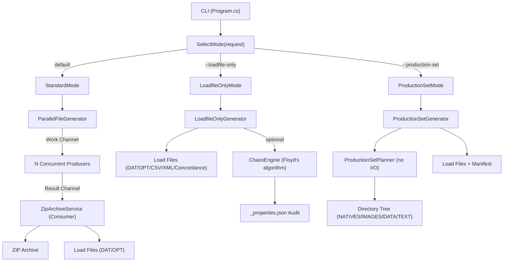

# Zipper Architecture

## Three Generation Modes

`Program.cs` uses `SelectMode(request)` → `IGenerationMode` → `GenerationRunner.RunAsync()` to dispatch to one of three strategies:

| Mode | Trigger | Adapter | Generator |
|------|---------|---------|-----------|
| **Standard** | default | `StandardMode` | `ParallelFileGenerator.GenerateFilesAsync()` → Archive (.zip) + Load File |
| **Loadfile-Only** | `--loadfile-only` | `LoadfileOnlyMode` | `LoadfileOnlyGenerator.GenerateAsync()` → Load File + `_properties.json` audit |
| **Production Set** | `--production-set` | `ProductionSetMode` | `ProductionSetGenerator.GenerateAsync()` → Directory tree (NATIVES/IMAGES/DATA/TEXT) + Load Files |

## Standard Pipeline

`ParallelFileGenerator` uses `System.Threading.Channels` for a producer-consumer pipeline:

1. **Work channel**: Produces `FileWorkItem` objects using the configured distribution algorithm. Bounded channel provides backpressure.
2. **Generation**: N concurrent producers generate file data and write to result channel. All file types run in parallel.
3. **Archive writing**: Single consumer (`ZipArchiveService`) writes ZIP entries, then writes Load Files via `ILoadFileWriter` implementations.
4. **Deadlock protection**: `Task.WhenAny` races consumer with producers; if consumer faults, result channel is completed with its exception to unblock producers.

## Chaos Engine (Loadfile-Only Mode only)

`ChaosEngine` uses Floyd's algorithm for O(k) exact random sampling of lines to corrupt. DAT and OPT anomaly types are cataloged in `ChaosAnomalyTypes.cs` — see source for current list. Tracked in `_properties.json` via `LoadfileAuditWriter`.

## Three-Mode Pipeline



## Component Map

```mermaid
graph LR
    subgraph CLI Layer
        CliParser["CliParser"]
        CliValidator["CliValidator"]
        RequestBuilder["RequestBuilder"]
    end

    subgraph Config
        FGR["FileGenerationRequest"]
        FGR --> Output["Output"]
        FGR --> Metadata["Metadata"]
        FGR --> LoadFile["LoadFile"]
        FGR --> Delimiters["Delimiters"]
        FGR --> Bates["Bates"]
        FGR --> Tiff["Tiff"]
        FGR --> Chaos["Chaos"]
        FGR --> Production["Production"]
    end

    subgraph File Generators
        EML["EmlFileGenerator"]
        TIFF["TiffFileGenerator"]
        Office["OfficeFileGenerator"]
        Placeholder["PlaceholderFileGenerator"]
    end

    subgraph Load File Writers
        DAT["DatWriter"]
        OPT["OptWriter"]
        CSV["CsvWriter"]
        XML["XmlLoadFileWriter"]
        CONC["ConcordanceWriter"]
    end

    subgraph Profiles
        Loader["ColumnProfileLoader"]
        DataGen["DataGenerator"]
        BuiltIns["BuiltInProfiles"]
    end

    CliParser --> CliValidator --> RequestBuilder --> FGR
    FGR --> File Generators
    FGR --> Load File Writers
    Profiles --> DataGen
```
