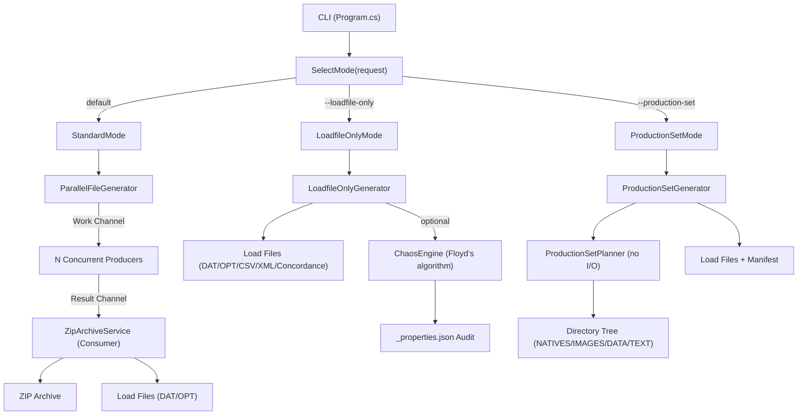

# Zipper Architecture

## Three-Mode Pipeline



## Component Map

```mermaid
graph LR
    subgraph CLI Layer
        CliParser["CliParser"]
        CliValidator["CliValidator"]
        RequestBuilder["RequestBuilder"]
    end

    subgraph Config
        FGR["FileGenerationRequest"]
        FGR --> Output["Output"]
        FGR --> Metadata["Metadata"]
        FGR --> LoadFile["LoadFile"]
        FGR --> Delimiters["Delimiters"]
        FGR --> Bates["Bates"]
        FGR --> Tiff["Tiff"]
        FGR --> Chaos["Chaos"]
        FGR --> Production["Production"]
    end

    subgraph File Generators
        EML["EmlFileGenerator"]
        TIFF["TiffFileGenerator"]
        Office["OfficeFileGenerator"]
        Placeholder["PlaceholderFileGenerator"]
    end

    subgraph Load File Writers
        DAT["DatWriter"]
        OPT["OptWriter"]
        CSV["CsvWriter"]
        XML["XmlLoadFileWriter"]
        CONC["ConcordanceWriter"]
    end

    subgraph Profiles
        Loader["ColumnProfileLoader"]
        DataGen["DataGenerator"]
        BuiltIns["BuiltInProfiles"]
    end

    CliParser --> CliValidator --> RequestBuilder --> FGR
    FGR --> File Generators
    FGR --> Load File Writers
    Profiles --> DataGen
```
