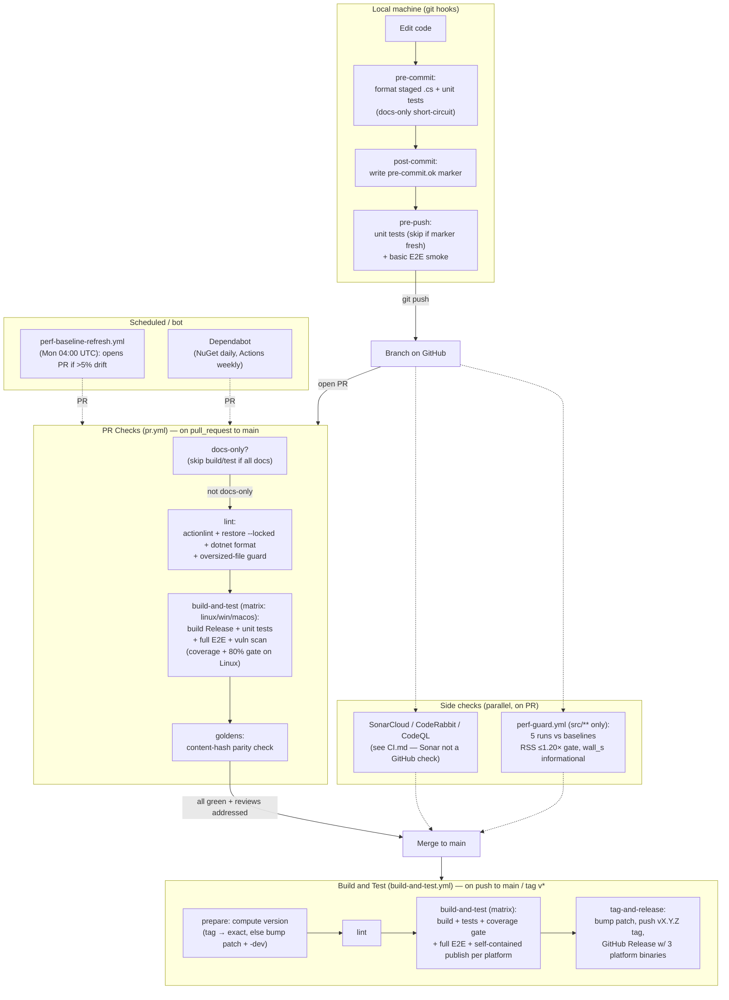

# CI/CD

How code travels from a local edit to a tagged release in Zipper, and the gates it must clear on the way. This is the **source-of-truth** map of the pipeline; [CI.md](../CI.md) holds the operational detail for external checks (SonarCloud, CodeRabbit, CodeQL, goldens, dependency policy), and [AGENTS.md](../AGENTS.md) holds the per-issue workflow.

> **For agents:** follow the [Quick Reference for Agents](#quick-reference-for-agents) — it maps each pipeline stage onto the local command that reproduces it, so you fail fast locally instead of waiting on CI.

## Pipeline overview

## Stages

### 1. Local git hooks

Version-controlled in [`.github/hooks/`](../.github/hooks/), installed with `./setup-hook.sh` (Linux/Mac) or `setup-hook.bat` (Windows). They copy into `$(git rev-parse --git-common-dir)/hooks/` and are worktree-aware.

| Hook | Trigger | Does |
|------|---------|------|
| `pre-commit` | `git commit` | Short-circuits if every staged file is docs (`*.md`, `*.txt`, `docs/`). Else stashes unstaged changes, runs `dotnet format` on staged `*.cs`, runs all unit tests. |
| `post-commit` | after commit object exists | Writes `pre-commit.ok` marker (timestamp + new HEAD) so pre-push can skip redundant unit tests. |
| `pre-push` | `git push` | Unit tests (skipped if marker is <10 min old on current HEAD) + basic E2E smoke (`tests/run-e2e-basic.sh` / `.bat`). |

Bypass (not recommended): `git commit --no-verify`, `git push --no-verify`. Full E2E + coverage run in CI only.

### 2. PR Checks — [`pr.yml`](../.github/workflows/pr.yml)

Trigger: `pull_request` → `main`. Concurrency-cancels superseded runs. Jobs are gated on `docs-only` so a pure-docs PR skips build/test entirely.

1. **docs-only** — diffs base..head; if **every** changed file matches a docs pattern, sets `only_docs=true` and the rest of the pipeline is skipped. A failed diff or zero changed files is treated as non-docs (fail-safe).
2. **lint** — `actionlint`, `dotnet restore --locked-mode`, `dotnet format --verify-no-changes`, and an oversized-file guard (>500 KB under `src/`, excluding `*.json`/`*.dat`/`*.opt`).
3. **build-and-test** — matrix over `ubuntu` / `windows` / `macOS`. Builds Release (includes tests), runs unit tests, full E2E suite. **Linux leg only** also: code coverage + **80% line-coverage gate** ([coverage-gate action](../.github/actions/coverage-gate/action.yml)), vulnerable-package scan (hard gate), test-timing report, and publishes the CLI as an artifact for goldens.
4. **goldens** — downloads the Linux CLI artifact and runs golden scenarios (content-hash parity). See [CI.md](../CI.md#goldens) to regenerate.

### 3. Side checks (parallel on PR)

- **perf-guard** — [`perf-guard.yml`](../.github/workflows/perf-guard.yml), triggered only on `src/**` changes. Runs `measure.sh` 5×, takes the median, compares to `tests/perf/baselines.json`. **RSS ≤ 1.20× baseline is the hard gate**; `wall_s` is reported but informational (shared-runner timing is noise-dominated). Posts/updates a single PR comment.
- **SonarCloud / CodeRabbit / CodeQL** — see [CI.md](../CI.md). SonarCloud is **not** surfaced as a GitHub check; fetch it manually after CI completes. CodeQL failures block merge. CodeRabbit blocking issues required, nitpicks optional.

### 4. Build and Test (main) — [`build-and-test.yml`](../.github/workflows/build-and-test.yml)

Trigger: `push` → `main`, and tags `v*`.

1. **prepare** — computes version. Tag push → exact `vX.Y.Z`; main push → next patch with `-dev` suffix.
2. **lint** — restore (locked) + format check.
3. **build-and-test** — same matrix as PR, plus a **self-contained per-platform publish** (`linux-x64`, `win-x64`, `osx-arm64`) uploaded as artifacts (7-day retention).
4. **tag-and-release** — main only, skipped on `[skip ci]`. Bumps the patch, pushes a `vX.Y.Z` tag, and creates a GitHub Release with the three platform binaries. The release body is sourced in priority order: (1) the merged PR's `## Release Notes` section, (2) GitHub Models AI summary of commits since the previous tag (model: `gpt-4o-mini`), (3) static fallback `"See commit history for changes in this release."` Agents and humans must include a `## Release Notes` section in every PR body — see [Release Notes Mandate](../AGENTS.md#release-notes-mandate). Idempotent: skips if the tag already exists. Release history is on the GitHub Releases page; there is no `CHANGELOG.md`.

### 5. Scheduled / bot

- **perf-baseline-refresh** — [`perf-baseline-refresh.yml`](../.github/workflows/perf-baseline-refresh.yml), Monday 04:00 UTC (or manual `workflow_dispatch`). Re-measures (5 runs, take max), and if any metric drifts ≥5% opens a `chore: refresh perf baselines` PR with a review checklist.
- **Dependabot** — [`dependabot.yml`](../.github/dependabot.yml). NuGet daily (grouped minor/patch vs major), GitHub Actions weekly. Subject to the **3-day waiting period** before merge — see [CI.md](../CI.md#dependency-update-policy).

## Gates summary

| Gate | Where | Blocking? |
|------|-------|-----------|
| Format (`dotnet format`) | pre-commit, lint | Yes |
| Unit tests | pre-commit/pre-push, build-and-test | Yes |
| Line coverage ≥ 80% | build-and-test (Linux) | Yes |
| Full E2E (all 3 OS) | build-and-test | Yes |
| Golden parity | goldens | Yes |
| Oversized file (>500 KB) | lint | Yes |
| Vulnerable NuGet packages | build-and-test (Linux) | Yes |
| Perf RSS ≤ 1.20× | perf-guard | Yes (RSS only) |
| Perf wall_s | perf-guard | No (informational) |
| SonarCloud BLOCKER/MAJOR | external | Yes (manual fetch) |
| CodeQL | external | Yes |
| CodeRabbit blocking | external | Yes (nitpicks optional) |

## Quick Reference for Agents

Reproduce each CI gate locally **before** pushing — CI minutes are slow feedback. Use `rtk` prefixes per [CLAUDE.md](../CLAUDE.md).

| CI gate | Local equivalent |
|---------|------------------|
| lint (format) | `dotnet format --verify-no-changes src/` |
| build | `dotnet build zipper.sln -c Release` |
| unit tests + coverage gate | `dotnet test src/Zipper.Tests/Zipper.Tests.csproj && dotnet test src/Zipper.Analyzers.Tests/Zipper.Analyzers.Tests.csproj` |
| full E2E | `dotnet build -c Release && ./tests/run-tests.sh` (Unix) / `dotnet build -c Release && tests\run-tests.bat` (Windows) |
| basic E2E smoke (pre-push) | `./tests/run-e2e-basic.sh` (Unix) / `tests\run-e2e-basic.bat` (Windows) |
| goldens | `dotnet publish src/Zipper.csproj -c Release -o ./publish-bin && ZIPPER_CLI=$(pwd)/publish-bin/Zipper bash tests/goldens/run-goldens.sh` |
| perf-guard | `dotnet publish src/Zipper.csproj -c Release -o ./publish-bin && ./tests/perf/measure.sh ./publish-bin/Zipper` |

**Rules of the road:**
- Install the hooks once (`./setup-hook.sh`) so format + tests run before every commit/push.
- A docs-only PR skips the build matrix — don't wait on jobs that won't run.
- Don't merge until PR Checks **and** side checks are green and all reviewer comments are addressed ([AGENTS.md workflow steps 9–12](../AGENTS.md#workflow-for-github-issues)).
- Changing a workflow? `actionlint` runs in `lint`; pin any new action to a full commit SHA (SonarCloud flags unpinned actions as security hotspots — see [CI.md](../CI.md#quality-gate-vs-code-issues)).
- A behavior change that alters perf or output **bytes** will trip perf-guard / goldens — that is the gate working, not a flake.
